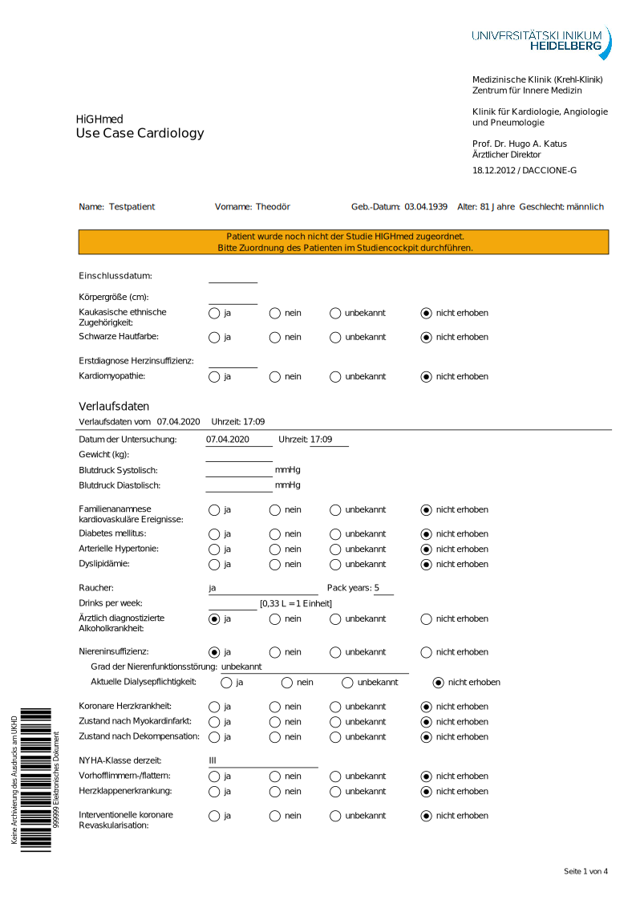

# Supplement: Preliminary analysis of structured reporting in the HiGHmed Use Case Cardiology: Challenges and Measures

## dPDF Document

In our study we performed several analyses on the content of the first 168 patients baseline measurements, that have been entered using the dynamic PDF form created for the UhGHmed Use Case Cardiology in Heidelberg. 

The screenshots of the form's pages are shown below (original document can be found in ./docs).
Note, that some options will be shown and hidden, depending on selections on the previous field. 

